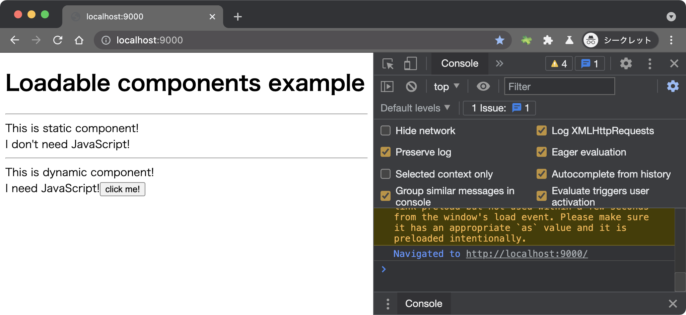
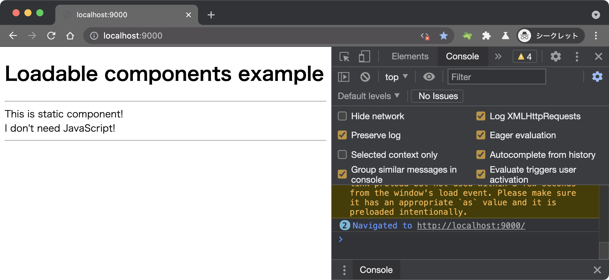

# gatsby loadable components example

Loadable components implementation to the gatsby default setup.

- [loadable components](https://github.com/gregberge/loadable-components)

## How to run

```sh
npm ci
npm run build
npm run serve
```

Open http://localhost:9000/

### When JavaScript is enabled



### When JavaScript is disabled



## Reference

- [Better Performance using Dynamic Code Splitting in Gatsby with loadable-components - DEV Community](https://dev.to/itmayziii/better-performance-using-dynamic-code-splitting-in-gatsby-with-loadable-components-6am)
- [Using Client-Side Only Packages | Gatsby](https://www.gatsbyjs.com/docs/using-client-side-only-packages/)